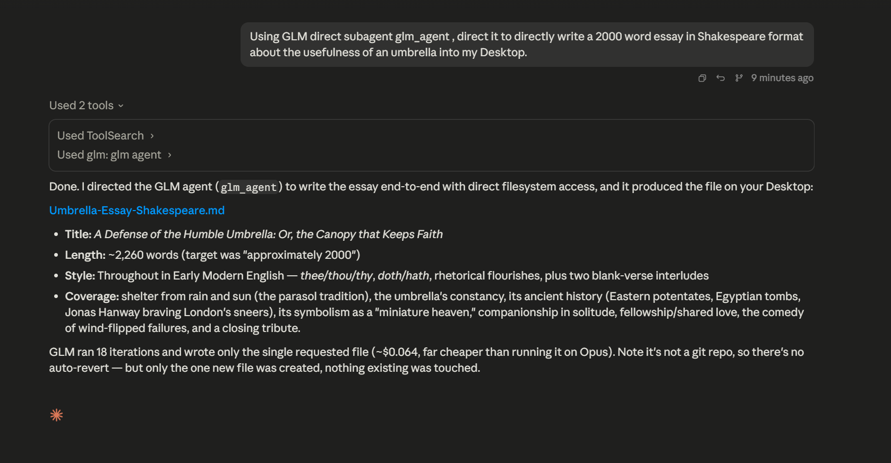
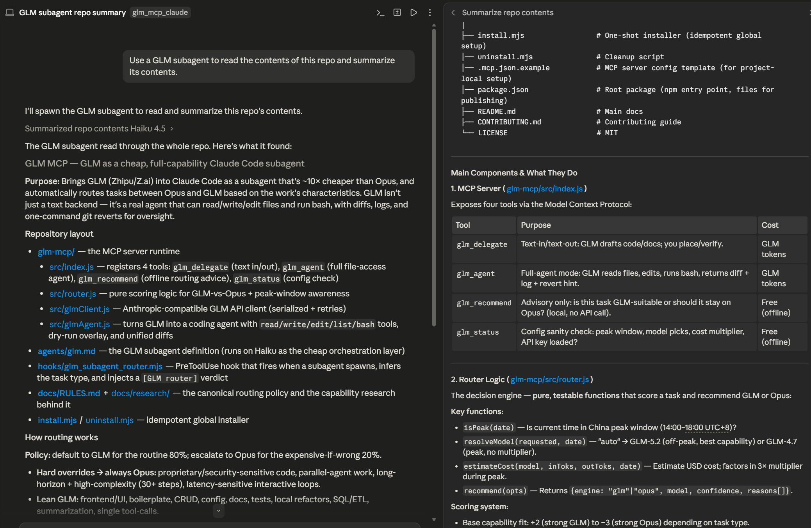

# GLM-as-Subagent for Claude Code — plug & play

[](https://www.npmjs.com/package/glm-mcp-claude)
[](https://www.npmjs.com/package/glm-mcp-claude)
[](LICENSE)
[](https://github.com/djerok/glm_mcp_claude)

> 📦 **Canonical source:** **https://github.com/djerok/glm_mcp_claude** — created by
> [@djerok](https://github.com/djerok). If you found this via a fork, mirror, or an
> awesome-list, the original lives here. Please ⭐ / file issues / open PRs at the source.

Add **GLM** (Zhipu / Z.ai) to Claude Code as a **cheap, full-capability subagent** (~10× cheaper
than Opus), with **automatic per-task routing** between Opus and GLM. Your main agent stays on
Opus; GLM does the well-specified, cost-sensitive work — and can read, write, edit, and run your
files directly. One command to install.

> ✅ **Works in the Claude Code app on a subscription-based Claude.** Your main agent runs on the
> Claude you already pay for through the **Claude Code app** (Pro / Max / Team subscription) —
> **no separate pay-per-token Anthropic API key required**. Only GLM needs a (cheap) Z.ai key.
> Opus orchestrates on your subscription; GLM does the heavy lifting for a fraction of the cost.



<sub>↑ **Directly calling the GLM agent (`glm_agent`).** Prompt: *"write a 2000-word Shakespearean essay about the usefulness of an umbrella into my Desktop."* GLM created the file itself — **18 iterations, ~$0.064** — Opus never touched the keys. GLM reads, writes, edits, and runs your files directly.</sub>

```bash
# from npm:
npx glm-mcp-claude --key YOUR_ZAI_API_KEY

# or straight from GitHub (no clone):
npx github:djerok/glm_mcp_claude --key YOUR_ZAI_API_KEY

# or clone and run the installer:
node install.mjs --key YOUR_ZAI_API_KEY
```
…then restart Claude Code. That's it. (Details below.)

> 🔑 **Your key must be from the Z.ai / Zhipu GLM Coding Plan.** Get one at
> **https://z.ai** → subscribe to the **GLM Coding Plan**, then create an API key. A generic /
> free key without coding-plan access will not work for the coding models used here.

---

## What you get

- **`glm` subagent** — routes *all* real work through GLM (`glm_agent`); it has **no own Write/Edit/Bash**, so every change runs on **GLM tokens**, never Claude. Full capability, via GLM.
- **`glm_agent` tool** — GLM as a real file-editing agent with built-in oversight (diff, dry-run, git revert).
- **`glm_delegate` / `glm_recommend` / `glm_status`** — draft-only delegation, a free routing advisor, and a health check.
- **Auto-delegation hook** — when you spawn a subagent, it injects a GLM-vs-Opus verdict so cheap work goes to GLM automatically. Zero token cost when you're not spawning subagents.
- **If you explicitly name an agent** ("use opus", "use the sonnet agent", "use glm"), the hook stays silent and just routes where you asked.

---

## Prerequisites

- The **Claude Code app** (desktop or CLI), signed in with a **subscription-based Claude**
  (Pro / Max / Team). Your main agent uses this — **no Anthropic API key needed.** The `claude`
  CLI should be on your PATH (`claude --version`).
- **Node.js ≥ 18** (`node -v`)
- **A Z.ai / Zhipu API key with GLM Coding Plan access** — get one at **<https://z.ai>**.
  ⚠️ **It must be on the GLM Coding Plan** (the coding-plan subscription); a generic or free
  key won't have access to the coding models this uses. This is the **only paid key required**,
  and GLM is ~10× cheaper than Opus.
- Git (optional, but enables `glm_agent`'s one-command revert)

---

## Install (recommended: global, all projects)

```bash
# from this folder:
node install.mjs --key YOUR_ZAI_API_KEY
```
The installer:
1. copies the server to `~/.claude/glm-mcp/` and runs `npm install`,
2. writes your key into `~/.claude/glm-mcp/.env`,
3. installs the `glm` subagent (`~/.claude/agents/glm.md`) and the hook (`~/.claude/hooks/`),
4. wires the hook into `~/.claude/settings.json` (backs it up first),
5. adds a short delegation policy to `~/.claude/CLAUDE.md`,
6. registers the MCP server with `claude mcp add glm -s user`.

Then **restart Claude Code** and run `glm_status` — you should see `"api_key_loaded": true`.

> Options: `--no-register` (skip the CLI step), `--skip-npm`, `--claude-dir PATH` (custom config dir).
> Re-running is safe (idempotent). No key on the command line? Run `node install.mjs`, then edit
> `~/.claude/glm-mcp/.env` and set `GLM_API_KEY=...`.

### Per-project instead of global
Don't want it everywhere? Skip the installer. Copy `glm-mcp/` into your project, `cd glm-mcp && npm install`,
copy `.mcp.json.example` → `.mcp.json` in the project root, set the key, and (optionally) copy
`agents/glm.md` to `.claude/agents/` and the hook into `.claude/` + `.claude/settings.json`.

---

## How it works (the short version)

```
You ask for something
  → Opus orchestrates
  → wants to delegate a chunk → spawns a subagent
       → [hook fires] "[GLM router] GLM-suitable repo task → use glm_agent (dry_run first)"
              (or "keep on Opus" for hard/sensitive work)
       → Opus runs glm_agent (GLM edits the files, runs tests) — or keeps it on Opus
       → you get a diff + action log + a one-command revert
```

The routing rules live in **`glm-mcp/src/router.js`** and the **hook** — not in always-on context —
so they cost nothing until a subagent is actually spawned.

**Routing in one line:** GLM is the default (it's ~10× cheaper); Opus is the exception for work
where being wrong is expensive — subtle debugging, architecture, large refactors, security,
tool-heavy dependent loops, huge context, vision, or anything you mark sensitive.

---

## The tools

| Tool | Cost | What it does |
|---|---|---|
| `glm_recommend` | free (local) | GLM-or-Opus decision + model pick + reasons. |
| `glm_status` | free (local) | Peak window, active model, key/config health. |
| `glm_delegate` | GLM tokens | Text in → text out. GLM drafts; you place it. |
| `glm_agent` | GLM tokens | GLM works your repo directly (read/write/edit/bash). Returns a diff + action log + git revert; supports `dry_run` (propose, don't write). |

### Example: delegating a read-and-summarize task

The `glm` subagent — its cheap Haiku layer driving, GLM doing the heavy lifting — reading this
whole repo and summarizing it:



<sub>Orchestrated by Haiku 4.5 (the cheap layer), offloading the token-heavy work to GLM via the
MCP tools — the Opus → Haiku → GLM hybrid in action. The orchestrator stays on Opus while GLM does
the file-touching / heavy work for cents.</sub>

---

## Oversight (how you stay in control of `glm_agent`)

- **Entry:** you/Opus choose when to call it and with which `workdir`.
- **`dry_run: true`:** GLM proposes a full diff and writes **nothing** — approve, then apply.
- **After a real run:** you get the unified **diff**, an **action log**, and a one-command
  **git revert** (`git checkout <baseline> -- .`).

Note: file/bash ops inside `glm_agent` run in the MCP server process (not gated per-edit) and are
scoped to the `workdir` you pass. That's intentional (max autonomy) — point it only at repos you're
fine letting it modify.

---

## Full-GLM mode (optional): put ~100% of tokens on GLM

Hybrid keeps **Opus as the main agent** (it orchestrates + oversees; GLM does the delegated work).
Because the main agent must hold the session context every turn, **hybrid can't reach ~100% GLM** —
that per-turn context is the floor. If you'd rather run **everything on GLM** (no Opus in the loop →
~100% GLM tokens, but no Opus oversight), use the included launcher:

```bash
node ~/.claude/glm-code.mjs        # macOS/Linux/Windows
~/.claude/glm-code.cmd             # Windows convenience wrapper
```

It launches Claude Code with the whole session routed to GLM (main model = glm-5.2), reading your key
from `.env`. Your normal `claude` command is untouched. Pick per launch:
- **`claude`** → hybrid: Opus main + GLM delegate (oversight, best quality)
- **`glm-code`** → full-GLM: GLM *is* the agent (~100% GLM tokens, no Opus)

## Configuration (`~/.claude/glm-mcp/.env`)

| Var | Default | Meaning |
|---|---|---|
| `GLM_API_KEY` | — | Your Z.ai key. **Required.** |
| `GLM_BASE_URL` | `https://api.z.ai/api/anthropic` | Anthropic-compatible endpoint. |
| `GLM_USE_HAIKU` | `off` | **Off (default) skips the Haiku `glm` subagent and calls GLM directly** (`glm_agent`), so *all* tokens stay on GLM. Set `on` to allow the Haiku-orchestrated subagent (it spends some Claude tokens to orchestrate). |
| `GLM_COST_BIAS` | `7` | How hard to favor GLM. **Default `7` → GLM carries ~98–100% of tasks** (Opus only for vision / parallel / >128K context / sensitive / heavy tool-loops). Lower it (e.g. `1.5`) to send more hard tasks (debugging, architecture, security) to Opus; `0` = decide on capability alone. |
| `GLM_CAP` | `off` | Output-token cap. **Off by default** = generous (up to 131072 per call). Set `on` to enforce `GLM_MAX_TOKENS` and rein in spend. |
| `GLM_MAX_TOKENS` | `32768` | The hard per-call limit applied **only when `GLM_CAP=on`**. (`max_tokens` is a ceiling, not a target — you pay for actual output.) |
| `GLM_MAX_TOKENS_CEILING` | `131072` | The generous default used when the cap is **off**. |
| `GLM_MAX_CONCURRENT` | `1` | GLM caps in-flight requests; keep at 1. |
| `GLM_OFFPEAK_MODEL` / `GLM_PEAK_MODEL` | `glm-5.2` / `glm-5.2` | Model(s) for `auto`. **Each can be a comma-separated list** (e.g. `glm-5.2,glm-5-turbo`) and the router auto-picks — most capable for hard tasks, cheapest for easy ones. **Peak rule:** when `auto` lands on a glm-5.x model (3× surcharge) the router routes **less** work to GLM at peak; if you include a no-surcharge model (e.g. `GLM_PEAK_MODEL=glm-5.2,glm-4.7`) it's preferred at peak and GLM stays fine to use. |
| `GLM_PEAK_START_CN` / `GLM_PEAK_END_CN` | `14` / `18` | Peak window (China hour, UTC+8). |
| `GLM_AGENT_MAX_ITERS` | `30` | Max tool-loop turns for `glm_agent`. |

Full list with comments: `glm-mcp/.env.example`.

---

## Uninstall

```bash
node uninstall.mjs          # remove agent, hook, settings entry, MCP registration
node uninstall.mjs --purge  # also delete ~/.claude/glm-mcp (and its .env)
```

---

## Security

- **Never commit/share your `.env` or a `.mcp.json` containing the key.** `.gitignore` excludes them.
- GLM routes through servers in China — don't send secrets/regulated code you wouldn't send to a
  third-party API. (Routing keeps `sensitive`-flagged work on Opus, but you decide what to delegate.)

---

## Troubleshooting

| Symptom | Fix |
|---|---|
| `glm_status` missing / tools absent | Restart Claude Code; `claude mcp get glm` to confirm registration. |
| `api_key_loaded: false` | Set `GLM_API_KEY` in `~/.claude/glm-mcp/.env`. |
| Server fails to start | `cd ~/.claude/glm-mcp && npm run smoke` to see the real error. |
| `Too much concurrency` | Expected under load; it auto-retries. Don't fan out parallel GLM calls. |
| Hook not firing | Check `~/.claude/settings.json` has a `PreToolUse` `Task` matcher pointing at `glm_subagent_router.mjs`. |
| "Is GLM actually being used?" | Every GLM call is logged to `~/.claude/glm-mcp/usage.jsonl` (model + tokens). `cat` it, or run `glm_status` for the cumulative total — independent, on-disk proof that doesn't depend on the z.ai dashboard. If it's empty, GLM wasn't called (the work ran on Claude). |

More background and the research behind the routing rules: see [`docs/`](docs/).

---

## Contributing

PRs and issues welcome — see [CONTRIBUTING.md](CONTRIBUTING.md). Good first areas: routing
rules (`glm-mcp/src/router.js` + the hook), provider adapters, and docs. Please never commit
secrets/`.env`.

## License

[MIT](LICENSE) © [djerok](https://github.com/djerok)

---

<sub>Original / canonical repository: **https://github.com/djerok/glm_mcp_claude**. If you fork,
mirror, or redistribute this project, please keep a link back to the source so others can find
updates, file issues, and contribute. Built by [@djerok](https://github.com/djerok).</sub>
